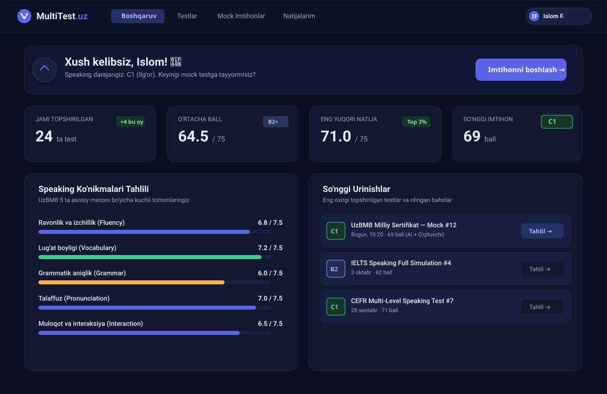
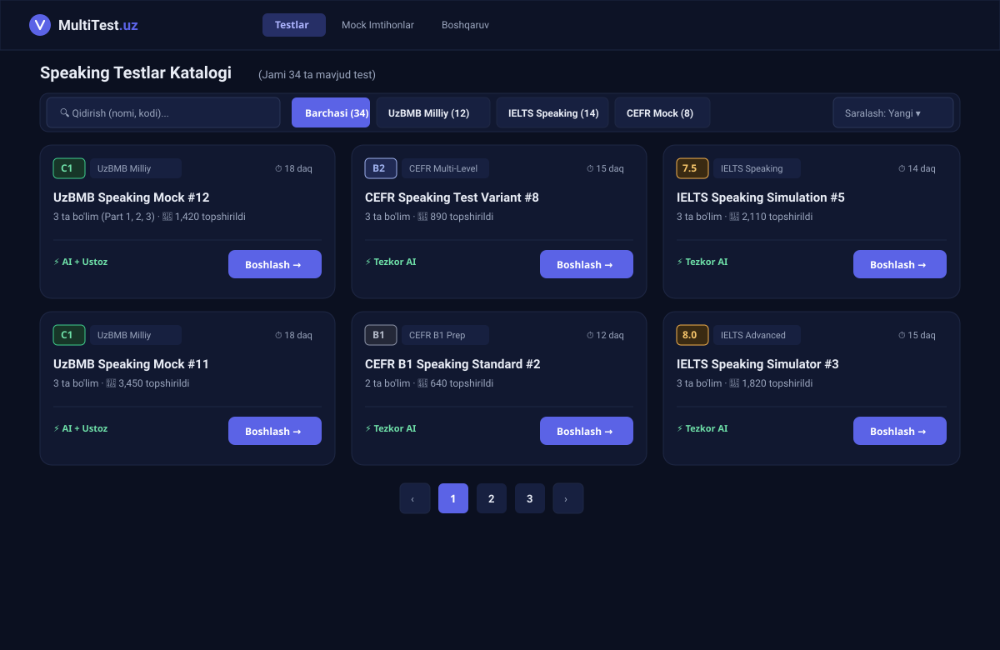

# MultiTest.uz — Butun Tizim Dizayni Tahlili va To'liq Vizual Mockup'lar

> Ushbu hujjat "A · Night Focus" dizayn tizimi (Tokenlar: `#0B1020`, `#111830`, `#172040`, `#5B63E6`) asosida butun MultiTest.uz platformasining har bir asosiy ekrani uchun tayyorlangan rasmlar va to'liq tahlilni o'z ichiga oladi.

---

## 1. Login & Register — SaaS Split-Screen *(Tasdiqlangan)*

Katta ekranda chap tomonda brend, sertifikat va statistika; o'ng tomonda toza tabli auth formasi.

### Asosiy yaxshilanishlar:
- Yuqorida silliq almashtirgich Tab: `[ Kirish ]` / `[ Ro'yxatdan o'tish ]`.
- Parolda ko'zcha (Show/Hide password) tugmasi.
- "Parolni unutdingizmi?" linki bevosita parol maydoni yonida.
- Google va Telegram orqali qulay bir bosishda kirish.
- Mobilda va Telegram Mini App'da ixcham, markaziy holatga avtomatik o'tish.

---

## 2. Global Modallar — Desktop Modal & Mobile Bottom Sheet *(Tasdiqlangan)*

Barcha pop-uplar (`dialog.tsx`) uchun yagona zamonaviy yechim.

### Asosiy yaxshilanishlar:
- **Desktopda:** `backdrop-blur-md` shisha effekti, burchaklari yumaloqlangan `rounded-2xl` kartochka, standartlashtirilgan ikonka chipi.
- **Mobilda va Telegram Mini App'da:** Pastdan silliq tepaga sirg'alib chiqadigan **Bottom Sheet (Pastki tortma)**. Tepadagi kichik tortish chizig'i (drag handle), virtual klaviatura ochilganda tabiiy tepaga surilish.

---

## 3. Asosiy Dashboard (`/dashboard`) — Yangi Dizayn

Hero banner, 4 ta statistika kartasi va so'nggi natijalar blokining to'liq yangilangan ko'rinishi.

### Asosiy yaxshilanishlar:
- **Birlashtirilgan Hero Banner:** Xush kelibsiz xabari va "Imtihonni boshlash" tugmasi bitta qatorda ixcham va hashamatli.
- **4-Stat Grid:**
  - Jami testlar soni va oylik o'sish.
  - O'rtacha ball va daraja nishoni (`B2+`).
  - Eng yuqori natija va o'rin.
  - So'nggi test natijasi: Yashil **CEFR C1** sertifikat nishoni bilan alohida ta'kidlangan.
- **Speaking Ko'nikmalari Tahlili:** 5 ta asosiy mezon bo'yicha vizual progress panellari.
- **So'nggi Urinishlar Ro'yxati:** Har bir testning daraja nishoni (`C1`, `B2`), olingan ball va bitta bosishda "Tahlil →" tugmasi.

---

## 4. Testlar va Mocklar Katalogi (`/test`, `/mock`) — Ixcham Kartochkalar (Compact Card Grid)

3 ustunli, ixcham va zamonaviy kartochkalar to'plami. Bitta ekranda scroll qilmasdan 6 tagacha to'liq testni qulay ko'rish mumkin.

### Asosiy yaxshilanishlar:
- **Ixcham Kartochka O'lchami (184px):** Avvalgi 480px balandlikdagi og'ir kartochkalar o'rniga nozik, tartibli kartochkalar.
- **Kartochka Ichki Ierarxiyasi:**
  - Yuqorida: Daraja nishoni (`C1`, `B2`, `7.5`) + Kategoriya + Davomiyligi (`⏱ 18 daq`).
  - O'rtada: Qalin test nomi + qisqa metama'lumot (`3 ta bo'lim · 👥 1,420 topshirildi`).
  - Pastda: Ajratuvchi nozik chiziq, `⚡️ AI + Ustoz` holati va `[ Boshlash → ]` tugmasi.
- **Tezkor va Toza:** Kompyuterda 3 ustun, planshetda 2 ustun, telefonda esa 1 ustunli ixcham kartochka sifatida mukammal moslashadi.

---

> 🔒 **Muhim eslatma:** Foydalanuvchi talabiga asosan **Practice jarayoni (QuestionPlayer)** hamda **Natijalar sahifasi (/attempt/[id])** rejadan to'liq chiqarildi va ularga hech qanday o'zgartirish kiritilmaydi.
