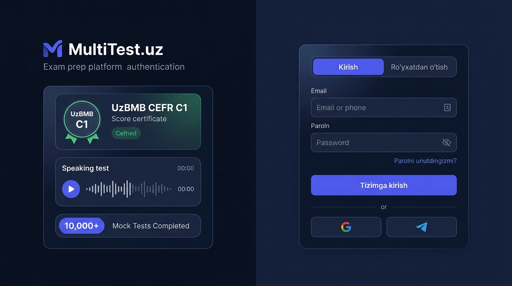
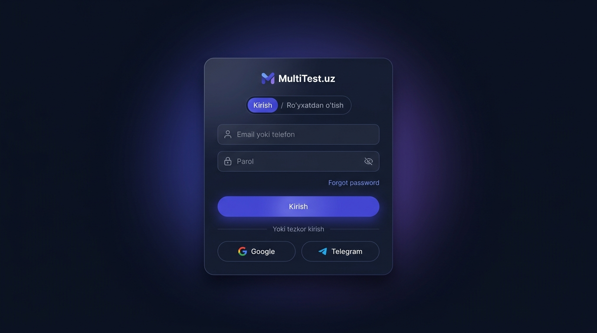
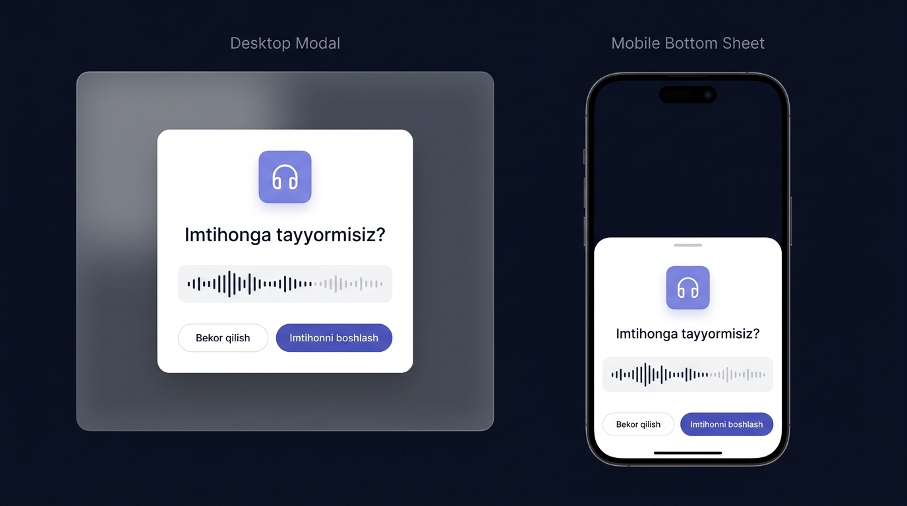

# MultiTest.uz — Login, Register & Modallar Dizayn Takliflari

Ushbu hujjatda Login / Register sahifalari hamda tizimdagi barcha Modallar (Dialoglar) uchun tayyorlangan yangi zamonaviy dizayn konsepsiyalari va ularning vizual tasvirlari keltirilgan.

---

## 1. Login & Register — 1-variant: "SaaS Split-Screen Showcase" (Tavsiya etiladi)

Katta ekranlarda (noutbuk, kompyuter) platforma brendini va imkoniyatlarini namoyish qiluvchi split-screen tartib. Mobilda esa o'ng tomondagi toza forma qulay moslashadi.

### Afzalliklari:
- **Chap tomonda mahsulot taqdimoti:** UzBMB CEFR C1 sertifikati, Speaking audio to'lqini va 10,000+ topshirilgan testlar statistikasi.
- **O'ng tomonda toza va ixcham forma:**
  - Yuqorida silliq almashtirgich Tab: `[ Kirish ]` / `[ Ro'yxatdan o'tish ]`.
  - Parolni ko'rsatish/yashirish uchun **Ko'zcha (eye icon)** tugmasi.
  - "Parolni unutdingizmi?" havolasi bevosita parol inputi yonida qulay joylashgan.
  - Google va Telegram orqali tezkor kirish tugmalari.

---

## 2. Login & Register — 2-variant: "Floating Glassmorphism Card"

Markazlashtirilgan, minimalistik shaffof-to'q shisha kartochka. Orqa fonda sokin ambient binafsharang/ko'k nurlar.

### Afzalliklari:
- **Fokus to'liq formaga qaratilgan:** Hech qanday chalg'ituvchi ortiqcha elementlarsiz toza interfeys.
- Barcha ekran o'lchamlari uchun birdek ixcham va yengil.
- Inputlar ichida `@` va `Qulf` nozik ikonkalar, ko'zcha tugmasi va yorqin submit tugmasi.

---

## 3. Modallar (Dialog) — "Desktop Center Modal & Mobile Bottom Sheet"

Tizimdagi barcha dialog oynalari (Imtihonni boshlash, kod kiritish, o'chirishni tasdiqlash va h.k.) uchun yagona zamonaviy yechim.

### Afzalliklari:
- **Desktopda:** Orqa fon xiralashishi (`backdrop-blur-md`), burchaklari yumaloqlangan `rounded-2xl` kartochka, mavzuli ikonka chipi va aniq ajratilgan Cancel/Confirm tugmalari.
- **Mobilda va Telegram Mini App'da:** Ekranning o'rtasiga osilib turmaydi, balki pastdan silliq chiqadigan **Bottom Sheet (Pastki panel)** tarzida ochiladi.
  - Tepadagi ushlagich chiziq (drag handle).
  - Telefon virtual klaviaturasi ochilganda tabiiy tepaga suriladi, tugmalar yo'qolib qolmaydi.
  - Bir qo'l (bosh barmoq) bilan boshqarish o'ta qulay.
